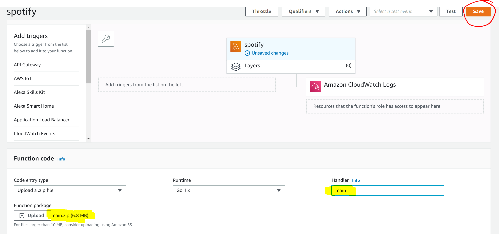
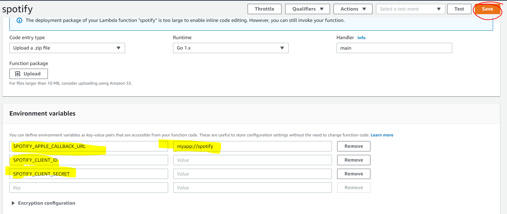
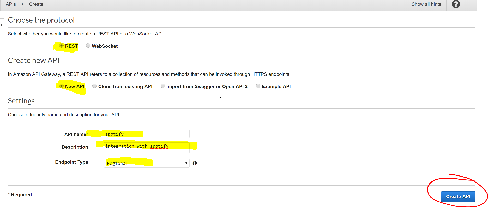
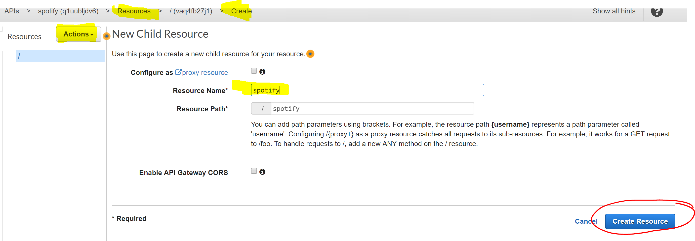
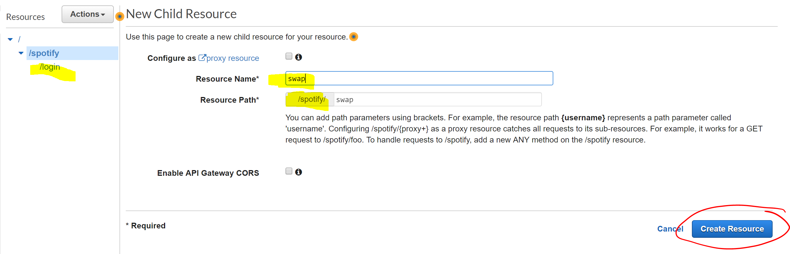
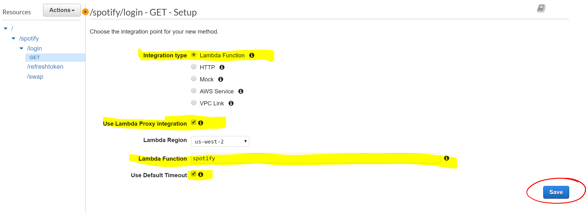
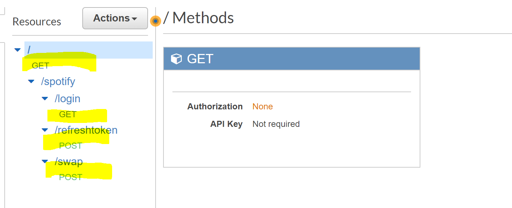
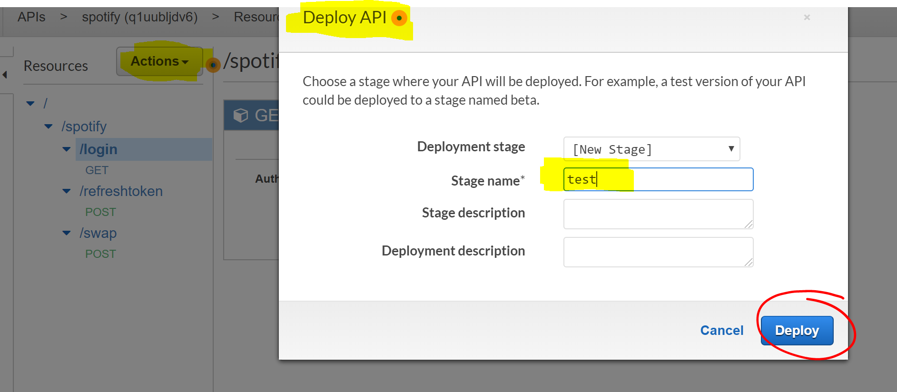

# spotify-web-api-auth
Using AWS lambda and Golang implement the endpoints for Spotify Athorization Code Flow  for mobile apps 

## endpoints 
**Login:**{{API_URL}}/spotify/login
**Swap Token:** {{API_URL}}/spotify/swap
**Refresh Token:**{{API_URL}}/spotify/refreshtoken

## Start 
1) cd into /src/main 
2) >go get -u github.com/golang/dep/cmd/dep
3) > dep init 
4) > dep ensure 
5) We use godep for package management see [dep](https://golang.github.io/dep/docs/installation.html)
6) > go build main.go
7) Make sure you do **step 6** before zipping the project, otherwise  the zip file won't have the latest build

   
### zipping the exec file aws lambdas  
 1) make sure to set **GOHOSTARCH="amd64"** and **GOOS="linux"** env vars 
 2) cd to `src/main`  and type `chmod +x main`  and    `zip main.zip main`
 3) if you are in using windows cd into `src/main` and type `bash` 
 
 # AWS Set up 
 
 ## Create Lambda 
 
 
 ### 1) create Spotify lambda 
 
 
 
 ### 2 Upload the zip file of your lambda to aws 
 
 
 
 ### 3 Set env vars for lambda 
 
 
 
 ### 4 Create an API with AWS API Gateway 
 
 
 
 ### 5 Create Spotify Resource for your API 
 
 
 
 #### 5.1 Create the other endpoints/resources with its methods 
 
 
 
 #### 5.2 create the methods of the resources using lambda proxy integration 
 
 
 
 #### 5.3 all endpoints and methods listed 
 
 
 
 ### 6 deploy the your API 
 
 This is an important step if you do not deploy the api the endpoints won't be available outside API Gateway console 
 
 
 
 
 
 
 
 
 
